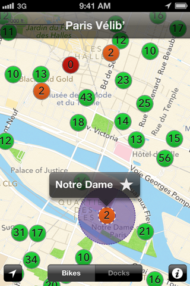

# Bicyclette

## La meilleure app pour Vélib

# Downloads

# Bicyclette traverse le périph&nbsp;!

Bicyclette 2.0 est en approche&nbsp;! Au menu, des favoris **revus et simplifiés**, et surtout, la compatibilité avec plus de **50 villes dans le monde**&nbsp;!

[Cliquez ici pour participer au beta-test&nbsp;!](https://testflightapp.com/join/166e579b32289df39a19676b1f49d823-MTU0MDU2/)

# Des vélos partout&nbsp;!

Bicyclette est compatible avec plus de 50 villes dans le monde.

* toot
* toot
* toot
* toot
* toot
* toot
* toot
* toot
* toot
* toot
* toot
* toot
* toot
* toot

# Une carte, c’est tout

Juste une carte pour indiquer les vélos et les places disponibles. C'est tout&nbsp;!

# Tout automatique

Indiquez vos favoris d'une étoile. Bicyclette crée une alerte géolocalisée alentour, et vous avertit automatiquement quand vous approchez. Vous n'avez même pas besoin de lancer l'app !

# Pay what you want

Bicyclette coûte ce que vous voulez, **c’est vous qui choisissez le prix**. Vous pouvez la télécharger gratuitement et si elle vous est utile, payer directement depuis l’appli.

# Open-Source

Cerise sur le gateau, Bicyclette est un projet open-source sur Github. Vous êtes développeur&nbsp;?  N'hésitez pas à jeter un coup d’oeil et à participer.

# Download

# Requirements

Bicyclette est compatible iPhone et iPad, et nécessite iOS 6.0 minimum.

# Une suggestion, un bug ?
  
* twitter : [@bicycletteapp](http://twitter.com/bicycletteapp)
* email : [support@bicyclette-app.fr](mailto:support@bicyclette-app.fr)

Bicyclette est un projet indépendant des société de vélo en libre service&nbsp;; l'appli récupère les données "open-data", ou dont l'utilisation est tolérée. [Plus d'infos](data.html)